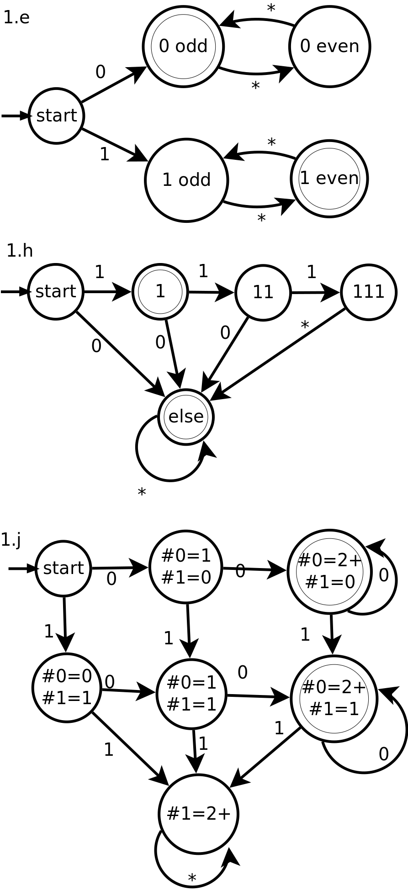
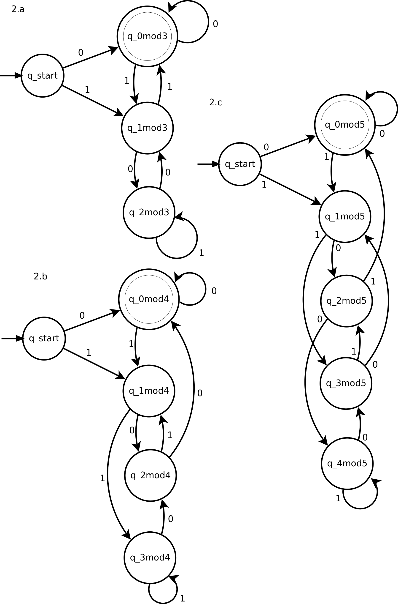

# CPSC 421 - Homework 4

Tristan Rice, 25886145, q7w9a

## 1

\

## 2

\

## 3

Discussed with q6y8@ugrad.cs.ubc.ca and b2a0b@ugrad.cs.ubc.ca .

A real number is algebraic if it satisfies an equation $p(x)=0$ where $p$ is a
nonzero polynomial with integer coefficients. Prove that the number of algebraic
numbers is countable.

To show that the number of algebraic numbers is countable, we can first show
that the set of polynomials of power $n$  ($p_n$) is a countable set.

The most number of coefficients for a polynomial of degree $n$ is $n$. The set
of integers $\mathbb{Z}$ is countable, and thus following Corollary 4.7 from the
uncountablity handout $\mathbb{Z}^n$ is countable. Thus the total number of
distinct polynomials of degree $n$ is countable.

Using Lemma 4.8, if $A_1, A_2, \ldots$ are countable sets then
$$\cup_{i\in \mathbb{N}} A_i$$
is a countable set.

The polynomial degree is $\in \mathbb{N}$ so thus
$$\cup_{i\in \mathbb{N}} p_i$$
is a countable set.

Thus, the set of all nonzero polynomials with integer coefficients is a
countable set.

The number of roots of a polynomial of degree $n$ is at most $n$. The number of
algebraic numbers is equivalent to the union of all roots of all polynomials.
Using the fact that a countable union of finite sets is countable, we see that
the number of algebraic numbers is countable.
