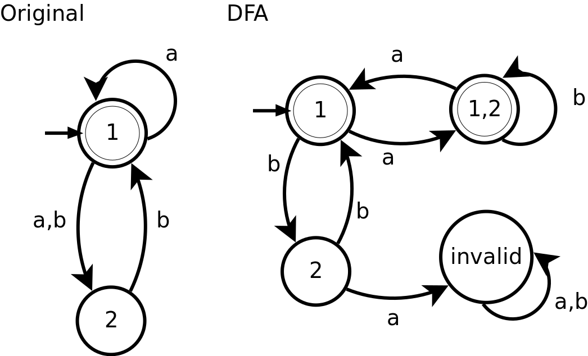
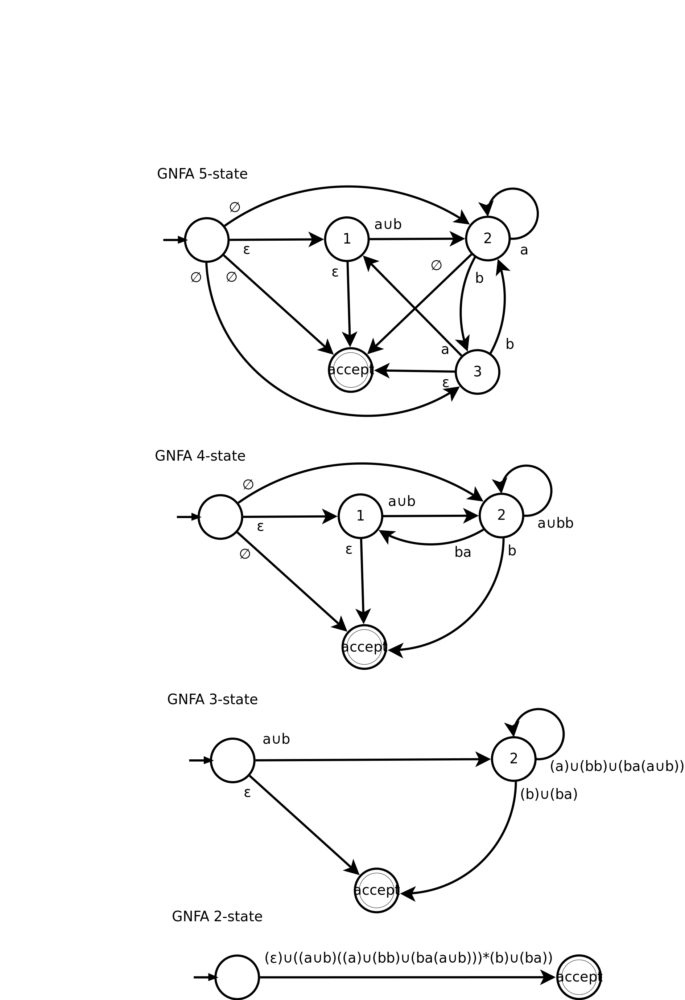

# CPSC 421 - Homework 5

Tristan Rice, q7w9a, 25886145

## 1

Possible states:

* empty {1}
* a {1, 2}
* b {2}
* aa {1}
* ab {1, 2}
* ba {}
* bb {1}

\

## 2

\

## 3

### 3.a

Claim: $\binom{2n}{n} \sim \frac{2^{2n}\gamma}{\sqrt n}$.

Proof:
$$n! \sim \sqrt{2\pi n} (n/e)^n$$

$$\begin{aligned}
\binom{2n}{n} &= \frac{(2n)!}{n!(2n-n)!} \\
& = \frac{(2n)!}{n!n!} \\
& \sim \frac{\sqrt{2\pi 2n} (2n/e)^{2n}}{\sqrt{2\pi n} (n/e)^n\sqrt{2\pi n} (n/e)^n} \\
& = \frac{(2n/e)^{2n}}{(n/e)^{2n}\sqrt{\pi n}} \\
& = \frac{2^{2n}}{\sqrt{\pi n}}
\end{aligned}$$

This is clearly equal to $\frac{2^{2n}\gamma}{\sqrt n}$
where $\gamma = \frac{1}{\sqrt pi}$.

Thus, $\binom{2n}{n} \sim \frac{2^{2n}\gamma}{\sqrt n}$.

### 3.b

Claim: $\binom{2n+1}{n} \sim \frac{2^{2n+1}\gamma}{\sqrt{n}}$.

Proof:

We know that $\binom{2n}{n} \sim \frac{2^{2n}\gamma}{\sqrt n}$. Thus, if we can
show that the asymptotic ratio is the same for
$\frac{\binom{2n+1}{n}}{\binom{2n}{n}}$ and
$\frac{2^{2n+1}\gamma/\sqrt{n}}{2^{2n}\gamma/\sqrt{n}}$, we know will that
$\binom{2n+1}{n} \sim \frac{2^{2n+1}\gamma}{\sqrt n}$

$$\begin{aligned}
\lim_{n\to\infty} \frac{\binom{2n+1}{n}}{\binom{2n}{n}}
&= \lim_{n\to\infty} \frac{(2n+1)!n!n!}{(2n)!n!(2n+1-n)!} \\
&= \lim_{n\to\infty} \frac{(2n+1)!n!}{(2n)!(n+1)!} \\
&= \lim_{n\to\infty} \frac{2n+1}{n+1} \\
&= 2
\end{aligned}$$

$$\begin{aligned}
\lim_{n\to\infty} \frac{2^{2n+1}\gamma/\sqrt{n}}{2^{2n}\gamma/\sqrt{n}}
&= \lim_{n\to\infty} \frac{2^{2n+1}}{2^{2n}} \\
&= \lim_{n\to\infty} 2 \\
&= 2
\end{aligned}$$

Thus, since the asymptotic ratios are the same, we know that
$\binom{2n+1}{n} \sim \frac{2^{2n+1}\gamma}{\sqrt{n}}$ must be proportional.

### 3.c

$$L = \{s\in\{0,1\}^* | s \text{ has } n \text{ zeros and } m \text{ ones, and }
m = n \text{ or }m=n+1 \}$$

If a DFA were to exist, it would have a walk counting function $f(l)$ equal to
the number of words of length $l$.

When length $l$ is even, $m=n$ and there are $\binom{2n}{n}$ words. When length
$l$ is odd, $m=n+1$ and there are $\binom{2n+1}{n}$ words.

For the even case, we know $\binom{2n}{n}$ is proportional to
$\sqrt{2^{2n}}\gamma n^{-\frac 12}$.
This means that $f(l) = \Theta(2^{l}n^r), r=-\frac12$. Since $r$ is not an
integer, $f(l)$ must not be a walk count due to Theorem 7.1 from handout 1.

For the odd case, we know $\binom{2n+1}{n}$ is proportional to
$\sqrt{2^{2n+1}}\gamma n^{-\frac 12}$.
This means that $f(l) = \Theta(2^{l}n^r), r=-\frac12$. Since $r$ is not an
integer, $f(l)$ must not be a walk count due to Theorem 7.1 from handout 1.

Thus, since the function $f(l)$ is not a valid walk count and no DFA can be
constructed for the language. Since all regular languages have a corresponding
DFA, $L$ must not be a regular language.

## 4

### 4.a

Claim: $L = \{1^m | 7$ divides $m\}$ is not recognized by a DFA with fewer
than 7 states.

Proof:
We can apply the Myhill-Nerode Theorem.

Say that for some $w\in \sum^*$, $xw \in L$, $yw\not\in L$, then $x,y$ are in
different states.

$$L\in\sum^*, x \in \sum^*$$

$$AcceptingFuture(L, x) = \{w\in \sum^* \}$$

$$L = \{1^m | 7 \text{ divides }m\}$$

$$AcceptingFuture(L, \epsilon) = (1^7)^*$$
$$AcceptingFuture(L, 1) = 1^6(1^7)^*$$
$$AcceptingFuture(L, 1^2) = 1^5(1^7)^*$$
$$AcceptingFuture(L, 1^3) = 1^4(1^7)^*$$
$$AcceptingFuture(L, 1^4) = 1^3(1^7)^*$$
$$AcceptingFuture(L, 1^5) = 1^2(1^7)^*$$
$$AcceptingFuture(L, 1^6) = 1(1^7)^*$$

Thus, since there are at least 7 distinct accepting futures, by the
Myhill-Nerode Theorem, the DFA representing this language must have at least 7
states.

### 4.b

Pumping Lemma:
Say that L is regular and accepted by a DFA of p states or fewer. Then if
$s\in L$  and $|S|\geq p$ we can write $S=xyz$ such that

1. $xz, xyz, xy^2z ,xy^3z,\ldots \in L$
2. $y \neq \epsilon$
3. $|xy| \leq p$

Claim: $L = \{1^m | m \text{ is a perfect square}\}$ is not regular.

Proof: Say L is regular and accepted by a DFA of p states.

Now consider $S=1^p \in L$. Using the pumping lemma, let $s=xyz$ such that 1-3
above hold.
Since $S=1^{2p} = xyz$ and $|xy|\leq p$, we have
$x=1^a, y=1^b, z=1^{2p-a-b}$

Thus, $\forall i \in \mathbb{N}$, such that $1^{a+bi}1^{2p-a-b}\in L$.

$1^{2p+b(i-1)}$ cannot be in $L$ since there is no constant $b$ such that
$\forall i \in \mathbb{N}, 2p+b(i-1)$ is a perfect square. That would imply
perfect squares are separated by a constant factor. Proof by contradiction. L
must not be regular.

