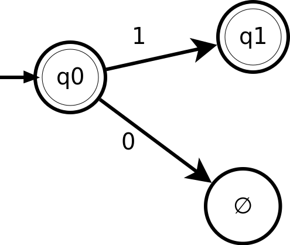
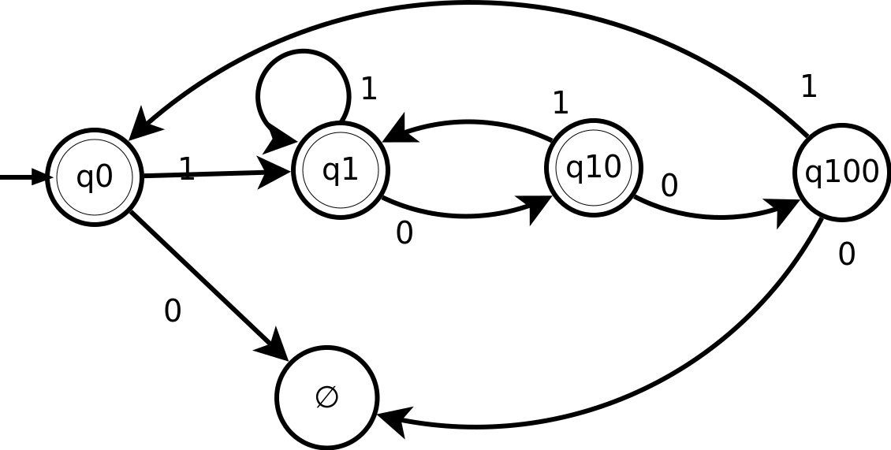

# CPSC 421 - Homework 6

Tristan Rice, q7w9a, 25886145

## 1

For languages A and B, let the shuffle of A and B be the language:

$$L=\{w|w=a_1b_1\ldots a_kb_k, \text{ where } a_1\ldots a_k \in A \text{ and }
b_1\ldots b_k \in B, \text{ each } a_i,b_i \in \Sigma^*\}$$

Claim: The class of regular languages is closed under shuffle.

## 2

$$F=\{a^ib^jc^k|i,j,k \geq 0 \text{ and if } i=1 \text{ then } j = k\}$$

Claim: F is not regular.

Proof:

We can use the Myhill-Nerode theorem to show that $F$ is not regular by looking
at
$$AcceptingFuture(F,s) := \{t|st\in F\}$$

Some of the possible accepting futures:
$$AcceptingFuture(F, \epsilon) = \{w\in F\}=F$$
$$AcceptingFuture(F, b) = b*c*$$
$$AcceptingFuture(F, bc) = c*$$
$$AcceptingFuture(F, aa) = a*b*c*$$
$$AcceptingFuture(F, aab) = b*c*$$
$$AcceptingFuture(F, aabc) = c*$$
$$AcceptingFuture(F, ab) = b^nc^{n+1}$$
$$AcceptingFuture(F, abc) = \varnothing$$
$$AcceptingFuture(F, ab^2c) = c$$

If we take this last one and parameterize it we get:

$$AcceptingFuture(F, ab^nc) = c^{n-1}$$

Thus, there are an infinite of distinct accepting futures. Thus, a DFA
matching this language has an infinite number of states. Thus, the language $F$
is not regular since it doesn't have a corresponding DFA.

## 3

$$F=\{a^ib^jc^k|i,j,k \geq 0 \text{ and if } i=1 \text{ then } j = k\}$$
$$L=ab^*c^*$$

$$F \cap L = \{ab^jc^k | j,k\geq 0 \text{ and } j = k\}$$

Pumping Lemma: Say that $F\cap L$ is regular and accepted by a DFA of p states
or fewer.

Then if $s\in F\cap L$ and $|s|\geq p$ we can write $s=xyz$ such that

1.  $xz,xyz,xy^2z, xy^3z$
2. $y\neq \epsilon$
3. $|xy| \leq p$

Claim: $F \cap L$ is not regular.

Proof: Say $F \cap L$ is regular and accepted by a DFA of p states.

Now consider $s = ab^{p-1}c^{p-1} \in F \cap L$. Then $s=xyz$ such that 1-3
above hold. Since $s= ab^{p-1}c^{p-1} = xyz$ and $|xy|\leq p$ we have
$x=ab^i, y=b^j,z=b^{p-i-j-1}c^{p-1}$.

So $xy,xyz,xy^2,xy^3z,\ldots, xy^nz \in L$.
From condition 2, $y\neq \epsilon$ so $j\geq1$ and
$ab^iz\in L, ab^{i+j}z \in L, ab^{i+2j}z \in L, ab^{i+kj}z \in L$.

Thus, $ab^{i+kj}b^{p-i-j-1}c^{p-1} \in L$.

This is impossible since according to $F \cap L$,

$$i+kj+p-i-j-1 = p-1$$
$$p-1 + (k-1)j = p-1$$

Thus, since this must hold for all $k \in \mathbb{N}$ according to the Pumping
Lemma, $F \cap L$ is not regular.

## 4

### 4.b

We can set $p=1$. $x=\epsilon, y=b^p, z=c^p$

This satisfies the three conditions for the pumping lemma.

1. $|y|\geq 1$ holds since $|b| \geq 1$.
2. $|xy| \leq p$ holds since $|b| \leq 1$.
3. $xy^nz \in L$ for all $n \geq 0$ holds since $b^nc \in L$.

### 4.c

Parts (a), (b) don't contradict the Pumping Lemma since it depends on carefully
picking the string $s=xyz$. The Pumping Lemma is mostly only used for showing
that languages are irregular via contradiction. To show that a language is
regular using the Pumping Lemma requires a proof for all strings in $l$ of
length at least $p$. (b) only shows one possible string that appears to be
regular and not all thus, doesn't prove that the language is regular.

## 5

### 5.a

$$AcceptingFuture(L, \epsilon) = (1 \cup 10 \cup 1001)^*$$
$$AcceptingFuture(L, 0) = \varnothing$$
$$AcceptingFuture(L, 1) = (\epsilon \cup 0 \cup 001)(1 \cup 10 \cup 1001)^*$$

### 5.b

* q0: $AcceptingFuture(L, \epsilon)$
* q1: $AcceptingFuture(L, 1)$
* $\varnothing$: $AcceptingFuture(L, 0)$

\

### 5.c

$$AcceptingFuture(L, \epsilon) = (1 \cup 10 \cup 1001)^*$$
$$AcceptingFuture(L, 0) = \varnothing$$
$$AcceptingFuture(L, 1) = (\epsilon \cup 0 \cup 001)(1 \cup 10 \cup 1001)^*$$
$$AcceptingFuture(L, 10) = (\epsilon \cup 01)(1 \cup 10 \cup 1001)^*$$
$$AcceptingFuture(L, 100) = 1(1 \cup 10 \cup 1001)^*$$
$$AcceptingFuture(L, 1000) = \varnothing$$
$$AcceptingFuture(L, 1001) = (1 \cup 10 \cup 1001)^*$$

\

