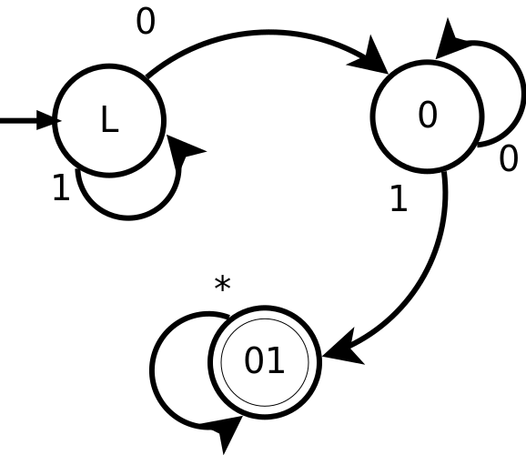

# CPSC 421 - HW7

Tristan Rice - q7w9a - 25886145

Discussed with q6y8@ugrad.cs.ubc.ca.

## Question 1

Give a formal description of a Turing machine--and explain how your machine
works--that recognizes the language

$$L=\{0^n10^n | n \text{ is a non-negative integer}\}$$

You should explicitly write your choice of
$Q, \Sigma, \Gamma, \delta, q_0, q_{accept}, q_{reject}$.

1. The string is provided on the first tape.
2. Copy the string on the first tape to the second in reverse order.
3. Scan both strings and make sure that the symbols on both are 0 until it hits
   symbol = 1. If both = 1, continue, else reject.
4. Continue scanning both strings making sure the symbols on both are 0. If it
   encounters a 1 reject. If it hits blanks on both, accept, else reject.


* $Q=$ reverse scan, reverse copy, reverse reset, looking for 1, seen 1, accept, reject
* $\Gamma=$ 0, 1, blank, beginning
* $\Sigma=$ 0, 1
* $q_0=$ reverse scan
* $q_{accept}=$ accept
* $q_{reject} =$ reject

```
delta(Q, Sym1, Sym2) {
  if Q == reverse scan {
    if Sym1 == blank {
      Q = reverse copy
      move head 1 left
    } else {
      move head 1 right
    }
  } else if Q == reverse copy {
    if Sym1 == beginning {
      move head 1 right
      Q = reverse reset
    } else {
      Sym2 = Sym1
      move head 1 left
      move head 2 right
    }
  } else if Q == reverse reset {
    if Sym2 == beginning {
      Q = looking for 1
      move head 2 right
    } else {
      move head 2 left
    }
  } else if Q == looking for 1 {
    if Sym1 != Sym2 {
      Q = reject
    } else if Sym1 == blank {
      Q = reject
    } else if Sym1 == 1 {
      Q = seen 1
      move head 1 right
      move head 2 right
    } else {
      move head 1 right
      move head 2 right
    }
  } else if Q == seen 1 {
    if Sym1 != Sym2 {
      Q = reject
    } else if Sym1 == blank {
      Q = accept
    } else if Sym1 == 1 {
      Q = reject
    } else {
      move head 1 right
      move head 2 right
    }
  }
}
```


## Question 2

Let $L=\{0^n10^n|n \text{ is a non-negative integer}\}$. What is $Future(L,0001)$? Explain.

$Future(L,0001)$ is the set of possible inputs such that the language $L$ will
accept the string $00001a$ where $a\in$ the possible inputs.

In this case, the only valid thing we can append to $0001$ for it to become a
valid string for language $L$ is $000$.

Thus,
$$Future(L,0001) = \{000\}$$

## Question 3

Claim: If $C_1, C_2, \ldots$ are countable sets, then $C_1 \cup C_2 \cup \ldots$
is countable.

Since each $C_i$ is countable, we may write each $C_i$ as $\{c_{i1}, c_{i2},
\ldots\}$. Then the sequence that lists each $c_{ij}$ in order of increasing
$i+j$ contains each element of $C_1 \cup C_2 \cup \ldots$.

Since it contains each element, we have an injuctive map
$\mathbb{S} \to \mathbb{N}$. Thus, the union of countable sets is countable.


## Question 4

Let $\Sigma$ be a finite, nonempty alphabet.

### (a)

Claim: $\Sigma^*$ is infinite but countable.

$\Sigma^*$ is trivially infinite since there's an infinite number of sequence lengths.

Since $\Sigma$ is countable we may write it as $\Sigma_{1}, \Sigma_{2}, \ldots$.
Thus, the sequence that lists each $\Sigma_{i_1}\Sigma_{i_2}\ldots$ in order of
increasing $\sum i$ contains each element of $\Sigma^*$.

Since it contains each element, we have an injuctive map
$\mathbb{S} \to \mathbb{N}$. Thus, $\Sigma^*$ is countable.

### (b)

We know that any subset of a countable set is countable. We also know that set
of positive integers is also countable. We know that the finite union of
countable sets is countable.

### (c)

## Question 5

$$L=\{x\in\{0,1\}^* | x \text{ contains 01 as a substring}\}$$

Using the Myhill-Nerode theorem we see there are the following states.

$$AcceptingFuture(L, \epsilon) = L$$
$$AcceptingFuture(L, 0) = 1\{0,1\}^* \cup L$$
$$AcceptingFuture(L, 00) = 1\{0,1\}^* \cup L$$
$$AcceptingFuture(L, 01) = \{0,1\}^*$$
$$AcceptingFuture(L, 001) = \{0,1\}^*$$
$$AcceptingFuture(L, 010) = \{0,1\}^*$$
$$AcceptingFuture(L, 1) = L$$
$$AcceptingFuture(L, 11) = L$$
$$AcceptingFuture(L, 10) = 1\{0,1\}^* \cup L$$

Thus, there are 3 distinct $AcceptingFuture$s and thus there are 3 state for the
DFA corresponding to $L$. Since we can construct a DFA for $L$, the language $L$
must be regular.

## Question 6

\


